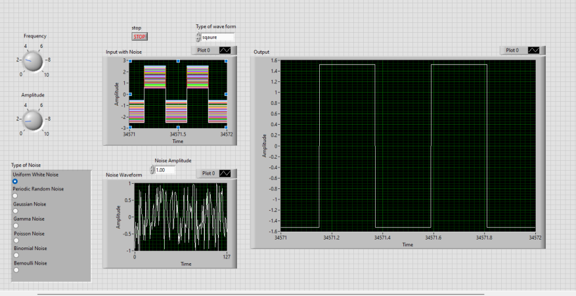

# LabVIEW Function Generator

A polished LabVIEW Function Generator for creating, corrupting, and restoring signals. This project simulates real-world signal conditions by producing configurable waveforms, adding a variety of noise types, and applying noise-removal techniques. It's ideal for teaching, experimentation, and validating filtration algorithms in a controlled environment.

---

  

## Highlights
- Clean, configurable waveform generation (sine, square, triangle)
- Multiple noise types with adjustable amplitude and parameters
- Noise removal using selectable filtering techniques
- Live visualization of clean, noisy, and filtered signals
- Modular LabVIEW design for easy extension and reuse

---

## Quick Overview
This system consists of four main modules:
1. Waveform Generator — produces target signals (sine / square / triangle) with user-defined frequency and amplitude.
2. Noise Generator — creates noise of several statistical types and configurable strength.
3. Signal Adder — combines clean waveform and noise to form a noisy signal.
4. Noise Removal Block — filters the noisy signal to reconstruct the original waveform.

Each module is implemented as a separate VI so you can test, swap, or refine components independently.

---

## Features

- Waveforms
  - Sine (continuous, smooth)
  - Square (adjustable duty cycle)
  - Triangle (linear ramp up/down)

- Noise Types (configurable amplitude / parameters)
  - Uniform white noise
  - Periodic random noise
  - Gaussian (normal) noise
  - Gamma noise
  - Poisson noise
  - Binomial noise
  - Bernoulli noise

- Noise Removal / Filters
  - Low-pass (ideal / Butterworth / Chebyshev)
  - Moving average
  - Median filter
  - Adaptive filters (e.g., LMS) — optional/extendable
  - Spectral subtraction (for periodic components)

- Visualization
  - Time-domain plots: clean | noisy | filtered
  - Optional frequency-domain display (FFT)
  - Parameter sliders / numeric inputs for live adjustment

---

## System Design & Block Diagram

Block Diagram (conceptual):
- Waveform Generator ->\
                         -> Signal Adder -> Noisy Signal -> Noise Removal Block -> Filtered Signal -> Displays
- Noise Generator    ->/

Each block is a LabVIEW VI with clear inputs and outputs:
- Waveform Generator VI: amplitude, frequency, phase, waveform type -> waveform array
- Noise Generator VI: noise type, amplitude, seed, extra params -> noise array
- Signal Adder VI: waveform array + noise array -> noisy array
- Noise Removal VI: noisy array, filter choice, filter params -> filtered array
- Display VI: plots arrays to front panel graphs

(Include your LabVIEW block diagram screenshot in the repository assets/diagrams folder as `block_diagram.png` for clarity.)

---

## Methodology (How to use)

1. Choose a waveform:
   - Select type (sine / square / triangle)
   - Set amplitude and frequency (and duty cycle if square)
2. Select noise:
   - Pick noise type and set amplitude (and distribution-specific parameters where applicable)
   - Optionally set a random seed for reproducibility
3. Add the noise to the clean waveform:
   - Use the Signal Adder panel to preview noisy output
4. Remove noise:
   - Choose a filtering technique and tune its parameters (cutoff, window length, order)
   - Run the Noise Removal VI and compare outputs
5. Analyze:
   - View time-domain and frequency-domain plots
   - Compute error metrics (e.g., RMSE, SNR improvement, correlation) to quantify restoration quality

---

## Results (Summary)
- The generator produces accurate and repeatable waveforms across the supported types.
- Added noise matches the selected statistical behavior and amplitude setting.
- Filters recover signals to varying degrees depending on noise type and filter selection:
  - Low-pass and moving average filters perform well on high-frequency, white noise.
  - Median filters are effective on impulsive noise.
  - Adaptive and spectral methods help with periodic or colored noise.
- Visualization and metrics allow objective comparison between methods.

---

## Recommended Parameter Ranges
- Frequency: 0.1 Hz to sampling_rate/2 (choose sampling rate accordingly)
- Amplitude: 0.0 (no signal) to desired max (UI limit)
- Noise amplitude: 0 (clean) to 1× waveform amplitude or higher for stress testing
- Filter cutoff: choose relative to signal frequency (e.g., 1.5× signal frequency for preserving fundamental)

---

## Example Use Cases
- Teaching basic signal processing concepts in labs
- Comparing filter performance under different noise models
- Stress testing detection or demodulation algorithms with realistic corruptions
- Rapid prototyping for embedded signal-processing workflows

---

## Suggested Extensions
- Add frequency-domain filtering and visualization controls
- Implement additional adaptive filters (RLS, Kalman)
- Real-time I/O: connect to DAQ hardware for live signal generation and acquisition
- Automated test suites: sweeps over SNR, noise types, and filter parameters with saved reports
- Export data & plots (CSV, PNG) for reporting

---

## Project Layout (suggested)
- /VIs
  - WaveformGenerator.vi
  - NoiseGenerator.vi
  - SignalAdder.vi
  - NoiseRemoval.vi
  - DisplayPanel.vi
- /assets
  - block_diagram.png
  - screenshots/
- /docs
  - README.md (this file)
  - theory.md (explanations of noise distributions & filters)
- /examples
  - example_sine_gaussian.lvproj
  - example_triangle_poisson.lvproj

---

## Notes on Noise Types (brief)
- Uniform White: every sample is drawn uniformly from a fixed interval.
- Gaussian: normal distribution; useful for many physical noise approximations.
- Poisson / Binomial / Bernoulli / Gamma: discrete or skewed distributions; good for modeling counting processes or non-symmetric variations.
- Periodic Random: combines deterministic periodic amplitude modulation with random variability to model repeating interference.

---

## Contact & Credits
Author: Prasad 
For suggestions, improvements, or example VIs to include, please open an issue or send a patch.

---

Thank you for trying the LabVIEW Function Generator.
